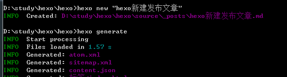

1、新建文章
2、编写makedown
3、发布
<!-- more -->
## 新建文章

```
hexo new "文章标题"
hexo generate
```
## 编写makedown
使用有道云编写makedown文档

## 发布

```
hexo clean
hexo generate
hexo deploy
```
## hexo插入图片

```
1、最后在xxxx.md中想引入图片时，先把图片复制到xxxx这个文件夹中，然后只需要在xxxx.md中按照markdown的格式引入图片：


注意： xxxx是这个md文件的名字，也是同名文件夹的名字。只需要有文件夹名字即可，不需要有什么绝对路径。你想引入的图片就只需要放入xxxx这个文件夹内就好了，很像引用相对路径。

2、 最后检查一下，hexo g生成页面后，进入public\2017\02\26\index.html文件中查看相关字段，可以发现，html标签内的语句是，而不是。这很重要，关乎你的网页是否可以真正加载你想插入的图片。
```


