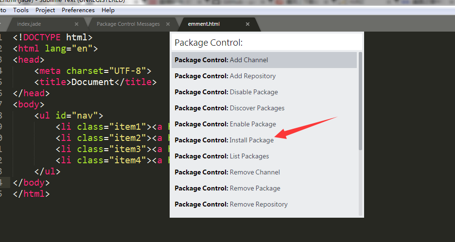
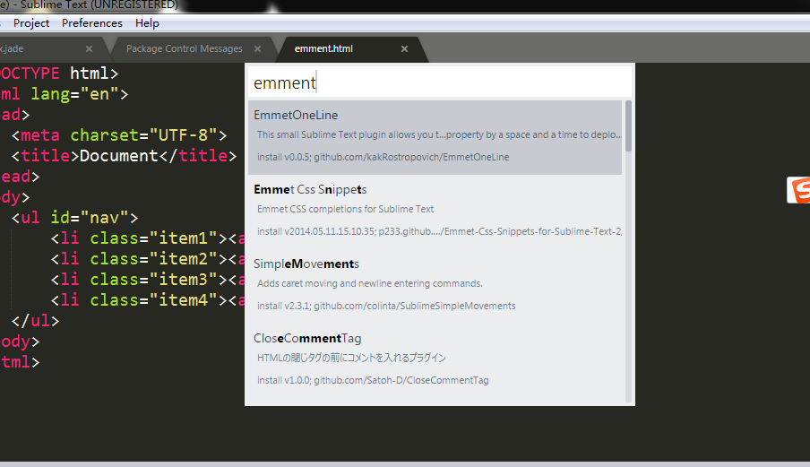
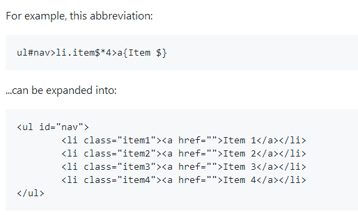
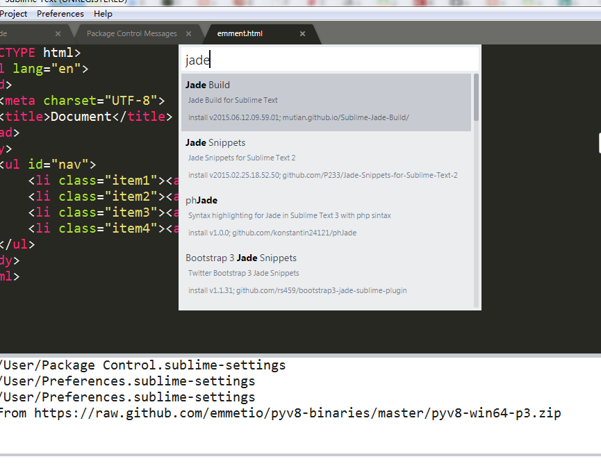
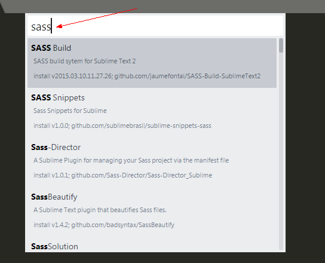

1、下载sublime text3安装包
2、安装Package Control
3、安装Emment（ emmet依赖pyv8）
4、安装jade高亮
......
<!-- more -->
注：需翻墙
### 1、下载sublime text3安装包
[sublime官网下载](http://www.sublimetext.com/)
### 2、安装Package Control
[package control官网](https://packagecontrol.io/installation)
快捷键 ctrl+~(调出控制台)
复制代码
```
import urllib.request,os,hashlib; h = '6f4c264a24d933ce70df5dedcf1dcaee' + 'ebe013ee18cced0ef93d5f746d80ef60'; pf = 'Package Control.sublime-package'; ipp = sublime.installed_packages_path(); urllib.request.install_opener( urllib.request.build_opener( urllib.request.ProxyHandler()) ); by = urllib.request.urlopen( 'http://packagecontrol.io/' + pf.replace(' ', '%20')).read(); dh = hashlib.sha256(by).hexdigest(); print('Error validating download (got %s instead of %s), please try manual install' % (dh, h)) if dh != h else open(os.path.join( ipp, pf), 'wb' ).write(by)
```
### 3、安装Emment（ emmet依赖pyv8）
打开package control(preferences->package control)


#### 测试Emment是否安装成功

### 4、安装jade高亮
打开package control

### 5、安装sass高亮（sass依赖ruby）
	sass

~~~
打开package control
Package Control: Install Package
输入ChineseLocalizations
~~~
### 6、安装中文插件
~~~
1、按Ctrl+Shift+P打开命令行；
2、输入Install Package，回车；
3、然后继续输入ConvertToUTF8，回车
~~~
### 7、中文乱码插件

#### npm安装jade
~~~
npm install -g jade
jade --version
jade -P -w index.jade
~~~


[赛风](https://s3.amazonaws.com/0ozb-6kaj-r0p8/zh/download.html)
[蓝灯](https://github.com/getlantern/forum#蓝灯lantern最新版本下载)
[fire](https://www.fanqiangzhe.com/software/)
Tunnello VPN
### 5、激活sublime
~~~
—– BEGIN LICENSE —–
TwitterInc
200 User License
EA7E-890007
1D77F72E 390CDD93 4DCBA022 FAF60790
61AA12C0 A37081C5 D0316412 4584D136
94D7F7D4 95BC8C1C 527DA828 560BB037
D1EDDD8C AE7B379F 50C9D69D B35179EF
2FE898C4 8E4277A8 555CE714 E1FB0E43
D5D52613 C3D12E98 BC49967F 7652EED2
9D2D2E61 67610860 6D338B72 5CF95C69
E36B85CC 84991F19 7575D828 470A92AB
—— END LICENSE ——
~~~
