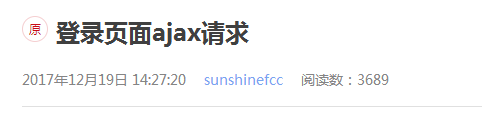

一、登录验证提示信息
二、验证码局部刷新
<!-- more -->

## login.js
### 一、登录验证提示信息


```
//提交登录信息
sub.on('click',function(e){
        e.preventDefault();
        var username=$('.login_box #Account').val()
        var password=$('.login_box #Password').val()
        var captchaCode=$('.login_box #Capcode').val()

        var param = {'username':username,'password':password,'captchaCode':captchaCode};
// console.log("Request param = "+JSON.stringify(param));
        $.ajax({
            type:"post",
            url:'/hjrz-webapp/app/admin/dologin',
            dataType: 'json',
            contentType:"application/json",
            cache : false,
            data: JSON.stringify(param),
        }).done(function(result){
            // console.log("++++" + JSON.stringify(result));
            if(result.code == '0'){
                $('.error5').html('')
                $('.error6').html('')
                $('.error7').html('')
                window.location.href='/hjrz-webapp/app/admin/index'
            }
            else if(result.code == '0100'){
                $('.error5').html(result.message)
                $('.error6').html('')
                $('.error7').html('')
            }
            else if(result.code == '0101'){
                $('.error6').html(result.message)
                $('.error5').html('')
                $('.error7').html('')
            }
            else if(result.code == '0102'){
                $('.error5').html('')
                $('.error6').html('')
                $('.error7').html(result.message)
            }
            else if(result.code == '0103'){
                $('.error5').html('')
                $('.error6').html('')
                $('.error7').html(result.message)
            }
            else if(result.code == '0104'){
                $('.error5').html(result.message)
                $('.error6').html(result.message)
                $('.error7').html('')
            }

        }).fail(function(){
            console.log('fail');

        });    

    })
```

### 二、验证码局部刷新

```
$(document).ready(function(){

    var sub=$('.sub input')
    var yzm=$('.reg-box li a')
    var yimg=$('.reg-box li img')
    yzm.on('click',function(){
        var num=Math.random()*10;
        yimg.attr('src','captchaCode?'+num)
    })
    yimg.on('click',function(){
        var num=Math.random()*10;
        yimg.attr('src','captchaCode?'+num)
    })
});
```
#### 解决火狐不发送ajax请求，刷新验证码没反应的问题

```
解决办法：加个随机数
（图片路径一样   有时候有缓存  图片不会重新加载）
原因：
js改了线上有缓存的时候   引入js也可以加随机数 清除缓存
后台看路径只看问号前面的
```
### ajax请求图片


```
$(".reg-box li img").click(function(){
         var url = "captchaCode";
         // var data = {type:1};
         $.ajax({
          type : "get",
          async : false, //同步请求
          url : url,
          // data : data,
          timeout:1000,
          success:function(dates){
          //alert(dates);
          $(".reg-box li img")[0].src="captchaCode";//要刷新的img
          },
          error: function() {
                // alert("失败，请稍后再试！");
              }
         });
     });
```
### login.jsp页面

```
<div class="login_box">
   <ul class="reg-box">
      <li>
        <label for="">账  号</label>
        <input id="Account" type="text" name="username" placeholder="请输入您的账号" class="account" maxlength="11"/>
        <span class="error error5"></span>
      </li>
      <li>
        <label for="">密  码</label>
        <input id="Password" type="password" name="password" class="admin_pwd" placeholder="请输入密码"/>
        <span class="error error6"></span>
      </li>
      <li>
        <label for="">验证码</label><input id="Capcode" type="text" name="captchaCode" class="sradd photokey" placeholder="请输入验证码" />
        
        <div class="tip">
            <span class="error error7"></span>
            <a >看不清，换一张</a>
        </div>

      </li>
   </ul>
   <div class="sub">
       <input type="button" value="立即登录" />
    </div>
</div>
```



